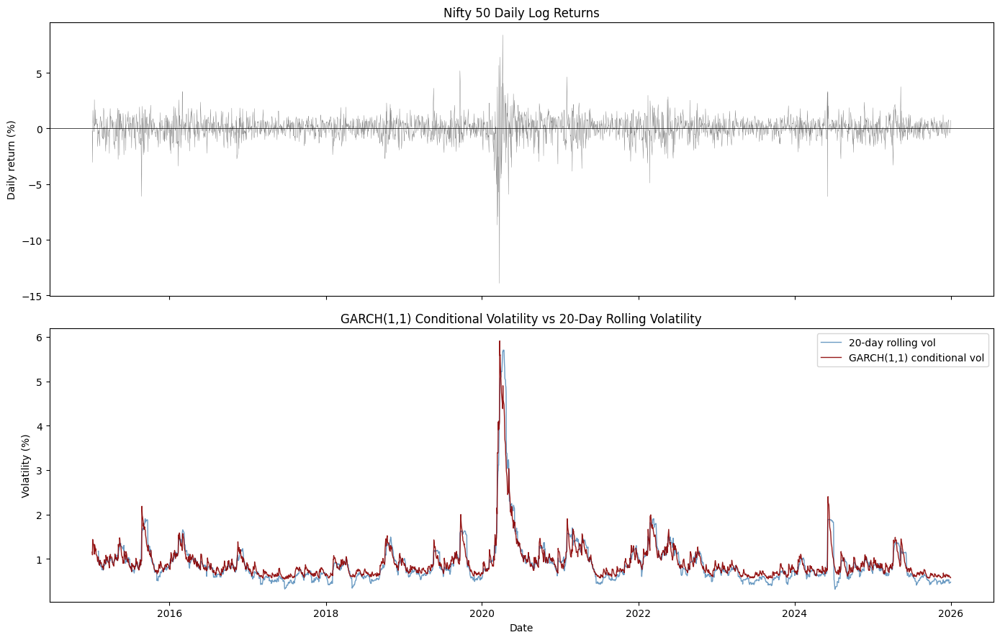

# GARCH-1-1 Volatility Modeling (NIFTY 50)
Fitting a GARCH Model on NIFTY 50 log returns (2015-2026)


## Overview
  Upon conducting a Ljung-Box and ACF test previously on the volatility of the National Stock Exchange of India index, NIFTY 50, the next suitable step to capture volatility clustering systematically is using the GARCH model. In this repository a plain GARCH model is utilized as compared to analyzing exogenous variables or the leverage effect in influencing volatilty which are deliberately deferred at this stage for the sake of conceptual buildup. The motivation behind GARCH analysis is simply to understand the effects of shocks on volatility and model it as a process in and of itself rather than plotting a simple 20-day rolling volatility window  which does not explain why volatility clusters.

  
## Data and Methodology
  As referenced in earlier projects, data of close prices is obtained for over a period of 11 years from (2015-2026) for the NIFTY 50 Index. Logarithmic returns are calculated from the close prices due to their time-additivity and ability to be converted back to a cumulative price level, properties which are not allowed by percentage returns. 
  
  Upon calculation of logarithmic returns a GARCH model is calculated specifying one lag for each of the ARCH terms (last period's squared shock and conditional variance) so upon fitting the model only the previous day's shock and conditional variance is considered. However the effects of clustering on the previous days' volatility are already factored in. Futhermore the model assumes that the standardized residuals Z{t} follow a normal distribution. Recently, instead of only fitting on a lag combination of (1,1) a for loop has been implemented to test the resulting AIC and BIC values for these lag combinations. The utlized combinations with their results are as follows:

| p | q | omega | alpha[1] | beta[1] | mean | AIC | BIC |
|---|---|-------|----------|---------|------|-----|-----|
| 1 | 1 | 0.02372 | 0.10406 | 0.87238 | 0.06747 | 6925.13 | 6948.75 |
| 1 | 2 | 0.02713 | 0.12181 | 0.64501 | 0.06800 | 6925.30 | 6954.82 |
| 2 | 1 | 0.02372 | 0.10407 | 0.87237 | 0.06747 | 6927.13 | 6956.65 |
| 2 | 2 | 0.02712 | 0.12181 | 0.64496 | 0.06800 | 6927.30 | 6962.72 |

As evident, the GARCH(1,1) candidate has the lowest AIC and BIC amongst all. Therefore, the specification of one lag for both the ARCH and GARCH term is justified.
Final (1,1) candidate parameters: 

| Parameter | Value |
|---|---|
| ω (omega) | 0.02372 |
| α (alpha) | 0.1041 |
| β (beta) | 0.8724 |
| Daily mean return | 0.0675% |
| Persistence (α + β) | 0.9764 |
| Volatility half-life | 29.1 trading days |

The calculated baseline volatility (omega) can help in calculating the long run unconditional volatility in the absence of shock using the formula:
```
σ²_long-run = ω / (1 − α − β) = ω / (1 − persistence)
```
This comes out to approximately 1.0025 percent daily volatility in the long run. In terms of Alpha and Beta, Beta is significantly larger than Alpha. This signals that the market volatility is driven more by the market's own volaitlity movements historically instead of market reaction to shock. This is typical of indexes such as the S&P500 and the NIFTY 50 since idiosyncratic noise caused by the price movements of a single stock are averaged out. The persistence remains close to but less than 1 given by the formula α + β, signalling that price shocks are highly persistent however mean-reverting since the value is less than 1. For a certain shock to decay to half of its long-run average, approximately 29 days are taken. Lastly, a daily mean return of 0.0675 percent translates to roughly 18 percent annual returns, consistent with the NIFTY 50's commendable performance over this period.

### Conditional vs Rolling Volatility:


With what is displayed by the graphs, the GARCH(1,1) modeled volatility is shown to react earlier to shocks, such as the early 2020 volatility spike than the rolling 20-day volatility and is shown to decay more gradually and smoothly as it returns to the long-run average volatility. The long run baseline volatility calculated earlier sitting at 1.0025 percent is confirmed as calm-period volatility visibly sits at approximately 1 percent in the long run.

Then, a Ljung-Box test is conducted on the standardized residuals (lags 1-10) to test if there is any remaining serial correlation in the residuals (to see if GARCH did its job and there are no remaining ARCH effects left over).

#### Ljung-Box Results
| Lag | LB Statistic | p-value |
|---|---|---|
| 1 | 8.96 | 0.0028 |
| 2 | 9.02 | 0.0110 |
| 3 | 9.22 | 0.0265 |
| 4 | 9.27 | 0.0547 |
| 5 | 10.64 | 0.0589 |
| 6 | 15.05 | 0.0199 |
| 7 | 15.15 | 0.0342 |
| 8 | 19.47 | 0.0125 |
| 9 | 19.84 | 0.0189 |
| 10 | 20.26 | 0.0269 |

At almost all lags the p-values obtained fall below 0.05. Due to p values being < 0.05 the null hypothesis of no autocorrelation is rejected. This means that the GARCH (1,1) fit fails to fully capture volatility clustering which is then being detected by the Ljung-Box test. However, the probable explanation here is the leverage effect. A negative shock influences volatility more than a positive shock and since a GARCH (1,1) model is fitted symmetrically it can not capture the leverage effect. This calls for the usage of the GJR-GARCH model. The specified model reacs differently to negative and positive shocks effectively capturing the leverage effect in volatility clustering.
